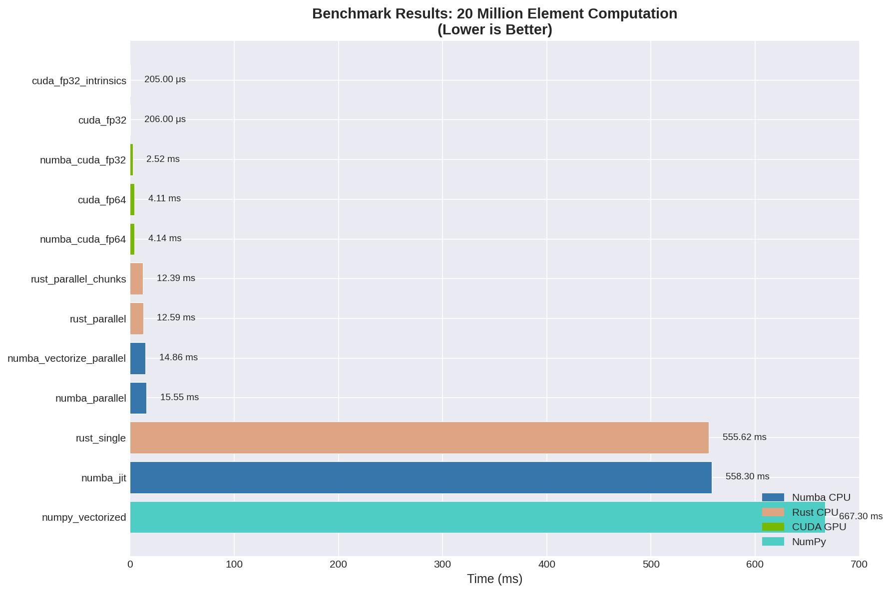
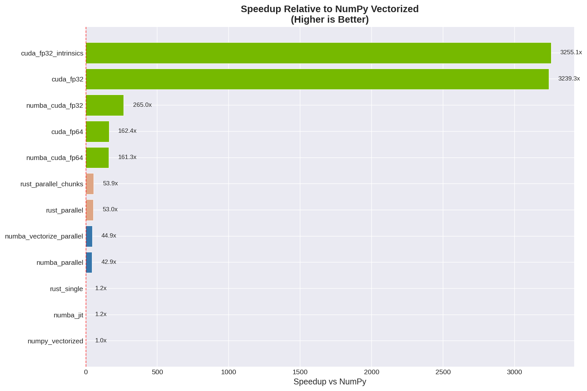
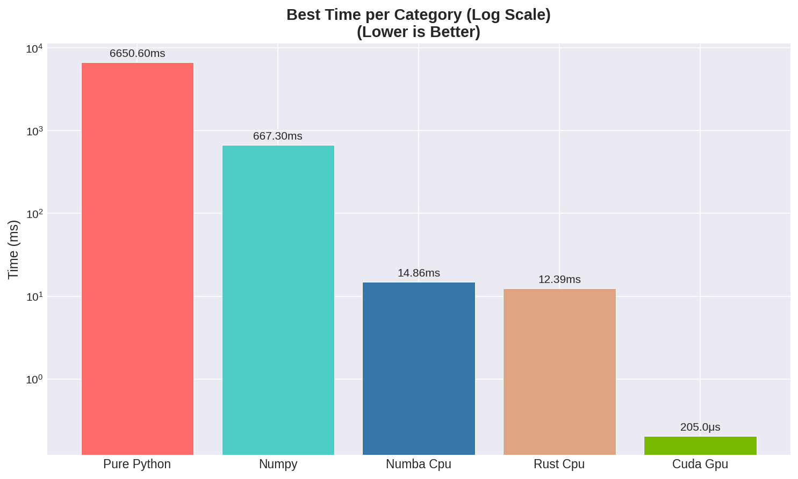

# Benchmark Results Summary

*Generated: 2025-12-25 15:48:57*

## All Implementations (Sorted by Speed)

| Rank | Implementation | Time | Speedup vs NumPy | Category |
|------|---------------|------|------------------|----------|
| 1 | cuda_fp32_intrinsics | 205.00 μs | 3255.1x | cuda_gpu |
| 2 | cuda_fp32 | 206.00 μs | 3239.3x | cuda_gpu |
| 3 | numba_cuda_fp32 | 2.5179 ms | 265.0x | cuda_gpu |
| 4 | cuda_fp64 | 4.1080 ms | 162.4x | cuda_gpu |
| 5 | numba_cuda_fp64 | 4.1379 ms | 161.3x | cuda_gpu |
| 6 | rust_parallel_chunks | 12.3857 ms | 53.9x | rust_cpu |
| 7 | rust_parallel | 12.5856 ms | 53.0x | rust_cpu |
| 8 | numba_vectorize_parallel | 14.8600 ms | 44.9x | numba_cpu |
| 9 | numba_parallel | 15.5468 ms | 42.9x | numba_cpu |
| 10 | rust_single | 555.6165 ms | 1.2x | rust_cpu |
| 11 | numba_jit | 558.2970 ms | 1.2x | numba_cpu |
| 12 | numpy_vectorized | 667.2992 ms | 1.0x | numpy |
| 13 | pure_python *(est)* | 6650.5974 ms | 0.1x | pure_python |

## Charts

